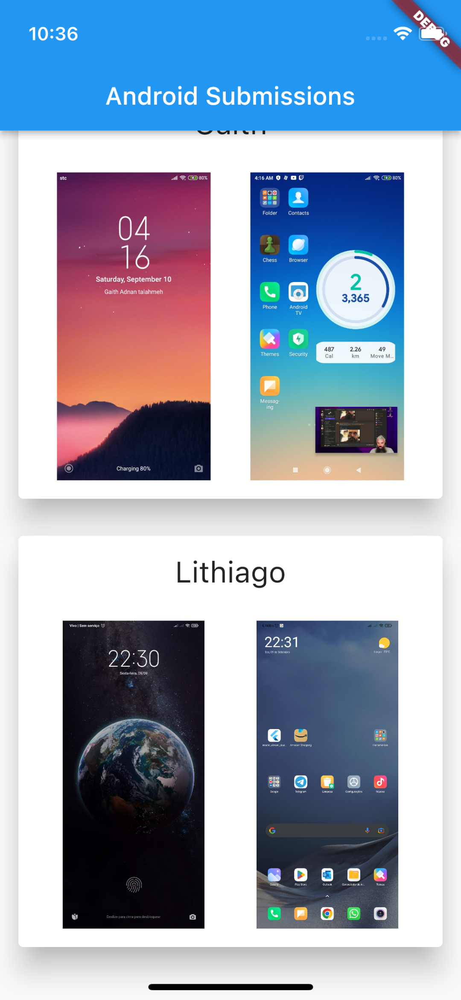

# pocketbase_flutter_app

A quick app written with PocketBase and Flutter live on [Twitch](https://twitch.tv/lukepighetti).

Displays user submissions of their Android home screen and lock screen.

## Environment Variables

We use two environment variables to skip login for testing purposes.

VSCode is currently setup to use environment variables from your system. Other IDEs will have to pass variables to `--dart-define`.

| environment variable | --dart-define  |
| -------------------- | -------------- |
| `PBF_TEST_EMAIL`     | `testEmail`    |
| `PBF_TEST_PASSWORD`  | `testPassword` |

## Contributing

Contributions are encouraged, but I expect a high standard of quality. I promise to give a thoughtful review and guide you towards success, even if you're new to coding.

Since your time is valuable, keep these points in mind:

1. Commit the minimum diffs to make your change
2. New UI should be _Material Plus_ (Material with a little extra sparkle ✨)
3. New UX should be simple and thoughtful
4. New code should follow existing patterns
